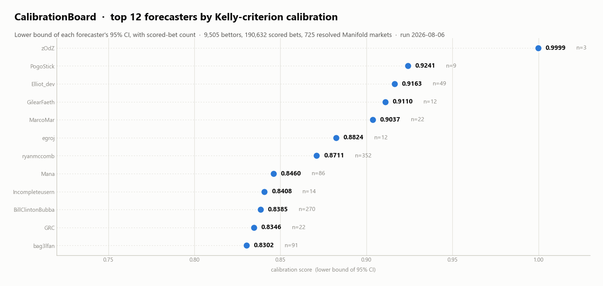

# CalibrationBoard - Prediction Market Data Modeling Pipeline



## Overview

Pulls the full public history off the [Manifold Markets](https://manifold.markets)
API and ranks forecasters by how well-calibrated their bets actually were, rather
than by profit - which mostly measures how much mana someone was willing to risk.

Each bet is scored with a Kelly-criterion metric against the bettor's balance at
the time of the bet, so a confident bet counts for more than a hedge. Users are
then ranked by the **lower bound of the 95% confidence interval** of their score,
not the mean, which is intended to stop a handful of lucky trades reaching the top.

## Scale

Figures below are from a re-run on **2026-08-06** (the banner reflects this run;
the outputs stored in the notebook are from the original February 2026 run):

| | |
|---|---|
| API calls | 12,147 |
| Markets fetched | 23,916 |
| Resolved markets after filtering | 725 |
| Bets fetched | 367,827 |
| Bets scored | 190,632 |
| Unique bettors | 9,505 |
| Bettors ranked (>1 scored bet) | 5,548 |
| Reported | top 30 |

## Pipeline

`TopManifold.ipynb`, in order:

1. Fetch topic groups, select by member count, fetch markets per group
2. Keep only resolved binary markets created after the cutoff, with >= 30 unique
   bettors and not resolved N/A
3. Fetch every bet on those markets placed more than a day before close
4. Drop bets by the market's own creator, reconstruct each bettor's balance
   history, and derive the Kelly proportion per bet
5. Score each bet, then take the lower bound of each user's 95% CI
6. Filter to platinum-division-or-better users and report the top 30

## Running it

```
pip install requests numpy scipy matplotlib
```

Every cell hits the live API. A full run is ~12,000 requests, and the results move
as new markets resolve.

## Known rough edges

- **Sample sizes are small and uneven.** The median ranked user has 4 scored bets
  and 1,519 of the 5,548 have exactly 2, while the largest have several hundred.
  The CI lower bound handles this as designed - the t-multiplier at n=3 is 4.303,
  and no ranked user has a degenerate (zero-variance) interval - but a top entry
  earned over 3 bets and one earned over 352 are different kinds of evidence. The
  banner prints n per row so the ranking can be read with that in view.
- **Topic selection is positional.** Cell 3 picks topics by hardcoded index into
  the members-sorted top 100, so a re-run selects whatever occupies those ranks
  that day rather than the same topics as a previous run.
- The market cutoff (`createdTime >= 1748736000000`, ~2025-06-01) is hardcoded, so
  the window widens every time the pipeline is re-run.
- Clipping is applied where balance reconstruction goes negative; noted inline in
  the notebook as worth revisiting.
